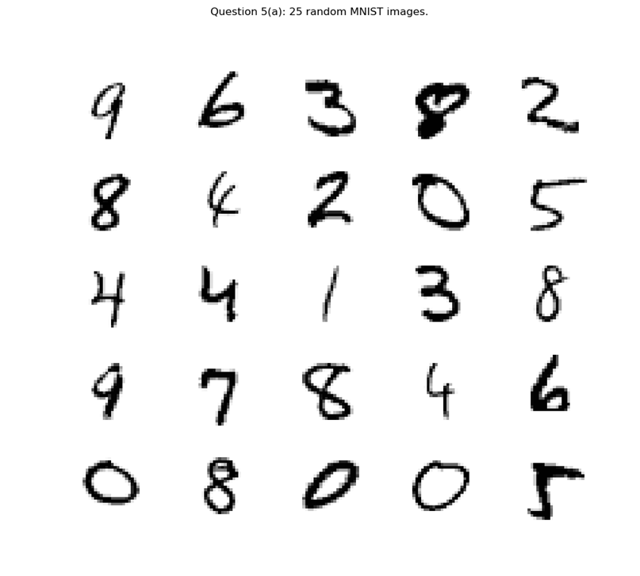
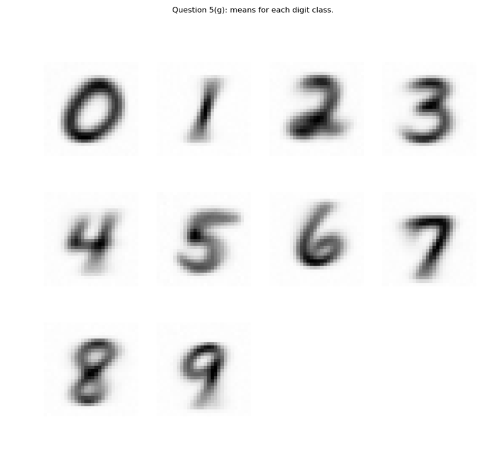
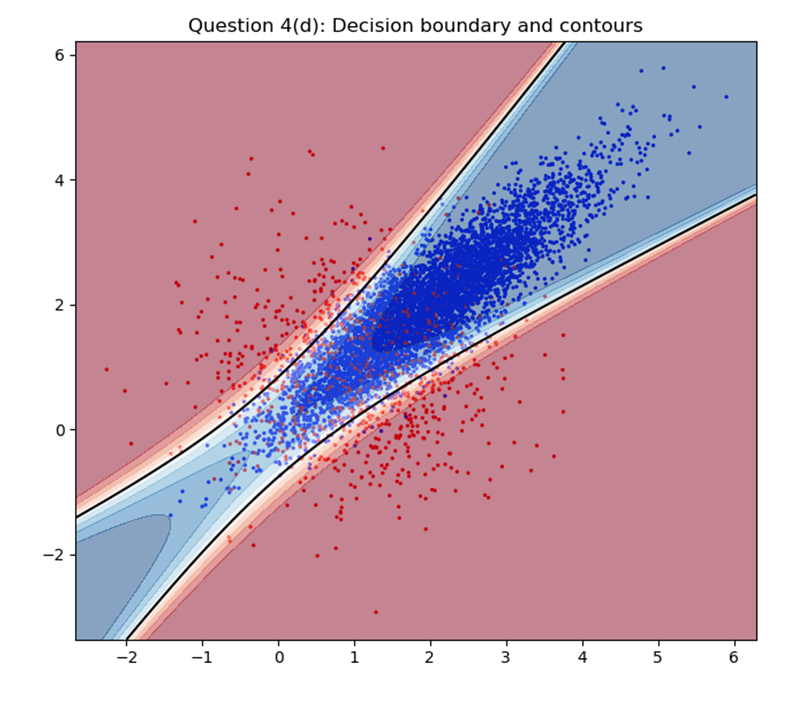
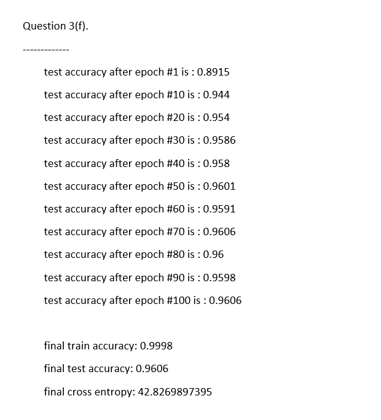
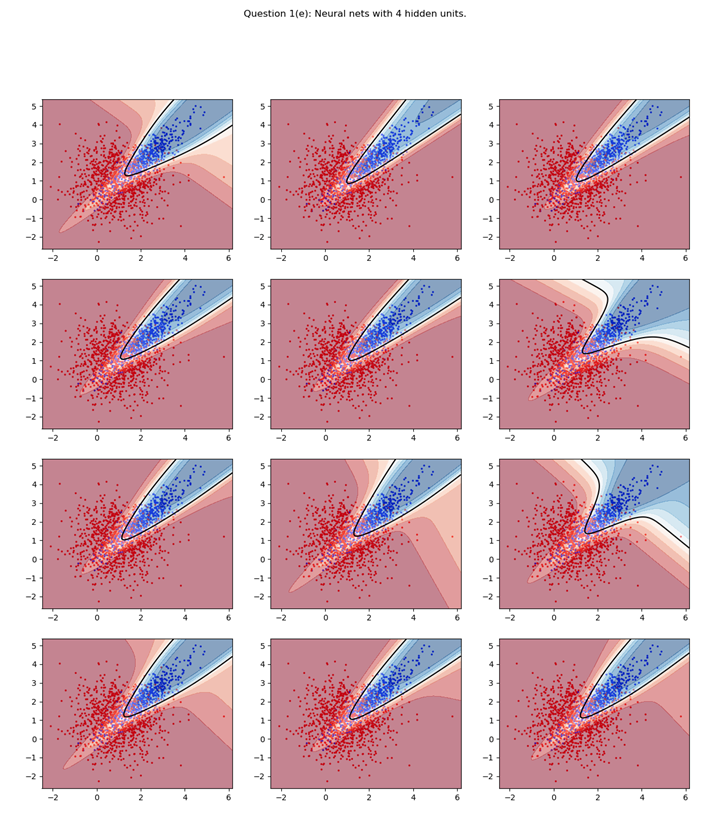
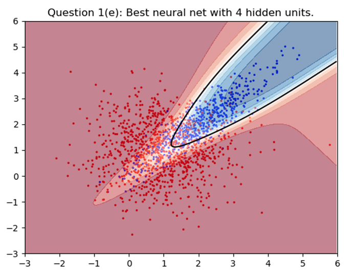

# csc411

## Assignment 2: Gaussian Bayes and Gaussian Naive Bayes Classifiers
[README.md](./a2/README.md) 

<!--  -->

## Assignment 3: Neural Networks - Stochastic, Mini-Batch, and Batch Gradient Descent Implementations
[README.md](./a3/README.md) 

 

